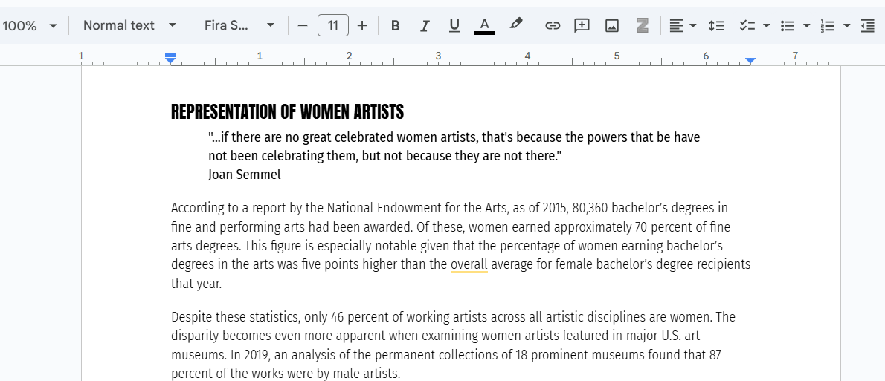
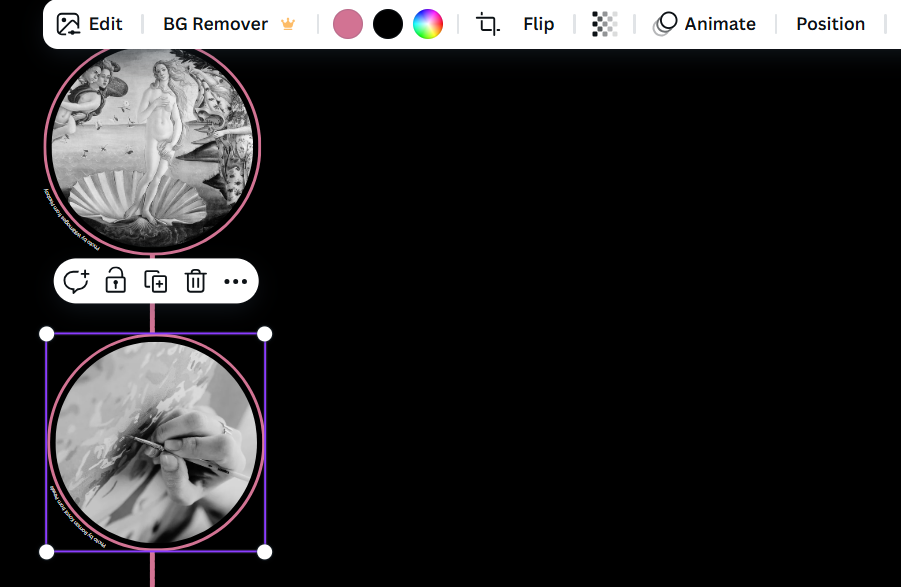
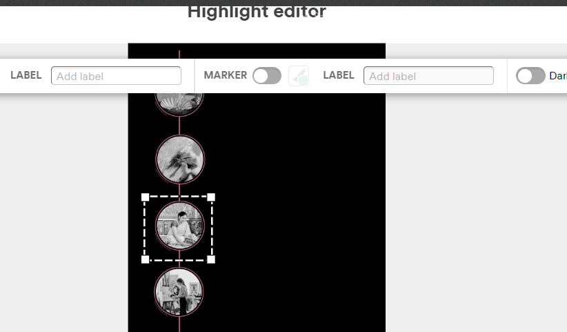

| [home page](https://belen-tc.github.io/BelenT-dataviz-portfolio/) | [data viz examples](dataviz-examples) | [critique by design](critique-by-design) | [final project I](final-project-part-one) | [final project II](final-project-part-two) | [final project III](final-project-part-three) |

# Wireframes / storyboards
Link to [Shorthand Preview](https://preview.shorthand.com/hEDLlpyhC9OgajWS)

To begin the storyboard, I first outlined the story in a Google Doc. This helped ensure that I included all key points and allowed me to determine the most effective order for each section. Since I was unfamiliar with Shorthand, I figured writing everything out in a simple document would save time, as I could easily copy and paste the text later. Additionally, reviewing the content across different formats (Google Docs, Shorthand, and data visualizations) helped me catch errors and identify areas for improvement.

Once I had the foundation of the story, I began working in Shorthand. From the start, I envisioned a timeline spanning from 1989 to 2025, with decade-specific information and accompanying graphs appearing as users scrolled. However, as I analyzed the datasets, I realized that many articles referenced the same limited sources. I also discovered that the Topaz et al. study was the first and only large-scale analysis of diversity in U.S. art museums. While this reinforced the need to raise awareness about representation gaps, it also meant I had less data to work with than I initially expected. To adapt, I revised my approach, rather than focusing on a full timeline of statistics, I decided to highlight pivotal moments in advocacy efforts.

At first, I included only five key years in the timeline, using Shorthand’s “Timelines” template as a starting point. I created a visual timeline in Canva, incorporating free stock images provided by the website. Uploading the timeline into Shorthand presented some challenges, particularly in setting up scroll points, but once I figured it out, I found the platform relatively easy to use (though still a bit glitchy).
 

One of my biggest questions was whether to integrate data visualizations into the timeline. Since not every event had enough numerical data to support a chart, I decided to address this during my interviews. After gathering feedback, I realized that adding graphs to the timeline made it visually overwhelming, as I had already included several images. Instead, I expanded the timeline to seven events, correcting some dates along the way. This allowed me to reserve the data-heavy visualizations for the next section, where I plan to present statistics on representation shifts between 2008 and 2018.

I am still finalizing these visualizations in Tableau and Datawrapper. During testing, I noticed that Shorthand does not fully support Tableau graphs, distorting the font and display. If I am unable to resolve this issue, I may explore alternative tools for presenting the data.

# User research 

## Target audience
> Include your approach to identifying representative individuals, and who you hope to reach with your story. 

Text here!

## Interview script
> List the goals from your research, and the questions you intend to ask. 

Text here!

| Goal | Questions to Ask |
|------|------------------|
|      |                  |
|      |                  |
|      |                  |

Text here!

## Interview findings
> Detail the findings from your interviews.  Do not include PII.  Capture specific insights where possible.

Text here!

| Questions               | Interview 1 (briefly describe) | Interview 2 | Interview 3 |
|-------------------------|--------------------------------|-------------|-------------|
| Question you asked here | Insightful feedback            |             |             |
|                         |                                |             |             |
|                         |                                |             |             |

# Identified changes for Part III
> Document the changes you plan on implementing next week to address any issues identified.  

Text here!

| Research synthesis                       | Anticipated changes for Part III                                                |
|------------------------------------------|---------------------------------------------------------------------------------|
| Findings or observations from interviews | Describe what, if any changes you anticipate making to address the observation. |
|                                          |                                                                                 |
|                                          |                                                                                 |
|                                          |                                                                                 |
| ...add more rows as necessary            |                                                                                 |

> ...include any final thoughts you have here. 

Text here!

# Moodboard

Text here!

## References
_List any references you used here._

## AI acknowledgements
_If you used AI to help you complete this assignment (within the parameters of the instruction and course guidelines), detail your use of AI for this assignment here._

